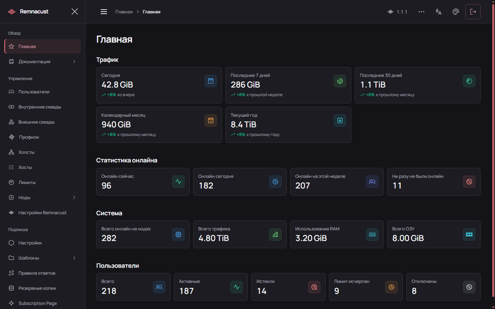

# Remnacust Panel

Панель управления пользователями, подписками, хостами и нодами Xray. Backend хранит данные в PostgreSQL, выполняет фоновые задачи и передаёт конфигурации нодам. Frontend предоставляет веб-интерфейс и документацию.

**Версия: 1.1.7.17** · **Основа: Remnawave 3.4.5**

При первом входе создайте администратора. Пароль должен содержать минимум 24 символа, заглавные и строчные латинские буквы и цифры. Кнопка в форме генерирует и копирует подходящий пароль из 32 символов. Ошибки ввода показываются под соответствующими полями до отправки запроса.



На главной собраны трафик за разные периоды, статистика онлайна, использование ресурсов и статусы пользователей. На снимке — демонстрационные данные.

## Возможности

- Пользователи: срок подписки, трафик, статус, сквады, импорт, экспорт и массовые операции.
- Устройства: регистрация HWID, лимиты, блокировка и отзыв доступа.
- Хосты и теги: квоты, коэффициенты учёта, ограничения скорости и персональный безлимит.
- Ноды: подключение, состояние, журналы, статистика и обслуживание Xray.
- Подписки: шаблоны, правила ответа клиентам и история запросов.
- Редактор Xray с проверкой конфигурации построителями нашего ядра.
- Зашифрованные копии БД, расписание и отправка в Telegram.
- API с правами операций; руководство на четырёх языках.

Для квот хостов, тегов и отзыва доступа устройств используйте [Remnacust Node](https://github.com/lottman/Remnacust-node/blob/main/node/README.md) с [нашим Xray](https://github.com/lottman/Remnacust-core/blob/main/xray/README.md). Подключение стандартных нод описано в [NODE-COMPATIBILITY.md](../docs/NODE-COMPATIBILITY.md).

## Сохранение профиля Xray

«Сохранить» проверяет JSON на сервере. Ошибка в поле `protocol` отклоняется с пояснением; профиль и история остаются прежними. Если проверка встроенного Xray показывает предупреждение, панель просит подтверждение сохранения. Оно не отключает серверную проверку.

После записи панель отдельно сообщает, поставлена ли конфигурация в очередь на ноды. Сообщение об очереди не означает, что Xray уже применил конфигурацию: итог смотрите в состоянии и журнале ноды. Старый ошибочный профиль можно открыть и исправить.

## Требования

Для установщика: только Ubuntu 22.04 LTS, 24.04 LTS или 26.04 LTS, amd64/arm64, root и домен панели. Docker и Compose добавляются при отсутствии. PostgreSQL, Valkey и Caddy для HTTPS входят в новую установку; собственный reverse proxy выбирается через `--proxy existing`.

Для планирования сервера используйте [требования Remnawave](https://docs.rw/install/requirements/): от 2 ядер CPU, 2 ГБ RAM и 20 ГБ диска; рекомендуются 4 ядра и 4 ГБ RAM. Сборка из исходников может потребовать дополнительную память и место.

## Установка через скрипт

Скопируйте всю строку в консоль сервера:

```bash
curl -fsSL --proto '=https' --proto-redir '=https' https://github.com/lottman/Remnacust-installer/releases/latest/download/installer.sh -o installer.sh && sudo bash installer.sh install-panel
```

[Скачать installer.sh](https://github.com/lottman/Remnacust-installer/releases/latest/download/installer.sh). Скрипт предложит выбрать версию выпуска установщика; Enter выбирает `latest`. Для конкретного выпуска добавьте `--version 1.2.39` (панель 1.1.7.17, нода 1.1.7 и ядро 1.1.5). Настройка доменов и reverse proxy: [INSTALLER.md](../docs/INSTALLER.md).

## Установка из исходников

Команды начинаются из корня репозитория. На новой установке создайте файл окружения:

```bash
cp panel/backend/.env.sample panel/backend/.env
chmod 600 panel/backend/.env
```

Заполните настройки перед запуском:

| Переменная | Значение |
| --- | --- |
| `APP_SECRET` | Случайный секрет, например результат `openssl rand -hex 64`. Сохраните его вместе с копией БД. |
| `POSTGRES_PASSWORD` | Собственный пароль PostgreSQL. |
| `DATABASE_URL` | Пользователь, пароль и база из `POSTGRES_*`, адрес `remnawave-db:5432`. Спецсимволы пароля кодируются для URL. |
| `PANEL_DOMAIN` | Домен панели, например `panel.example.com`. |
| `FRONT_END_DOMAIN` | Origin интерфейса, например `https://panel.example.com`. |
| `SUB_PUBLIC_DOMAIN` | Адрес подписок без схемы и завершающего `/`, например `panel.example.com/api/sub`. |
| `METRICS_USER`, `METRICS_PASS` | Данные доступа к метрикам. |
| `WEBHOOK_SECRET_HEADER` | Случайный секрет для проверки webhook, если они используются. |

`HWID_ENABLED_DEFAULT=true` включает HWID в настройках новой установки. Обновление сохраняет значение, уже выбранное в БД. Персональные данные доступа устройств включаются через `XERA_PERSONAL_SUBSCRIPTIONS=true`; для регистрации нужен клиент с поддержкой HWID-заголовков.

```bash
cd panel/backend
docker compose -f docker-compose-prod.yml up -d --build
docker compose -f docker-compose-prod.yml ps
docker compose -f docker-compose-prod.yml logs --tail=100 remnawave
```

При старте применяются миграции и начальные настройки. Данные PostgreSQL и резервные копии хранятся в постоянных томах.

Направьте HTTPS reverse proxy на `http://127.0.0.1:3000`. Панель должна открываться в корне домена. Метрики на порту 3001 и PostgreSQL на 6767 оставьте доступными только локально. Схема размещения: [официальная инструкция Remnawave](https://docs.rw/install/remnawave-panel/).

После запуска откройте панель и создайте первого администратора.

## Первое подключение

1. Создайте профиль Xray с нужным inbound и уникальным tag.
2. Добавьте ноду, скопируйте ключ подключения и установите [агент](https://github.com/lottman/Remnacust-node/blob/main/node/README.md).
3. Назначьте ноде профиль и активируйте inbound.
4. Создайте внутренний сквад, разрешающий этот inbound.
5. Создайте хост с внешним адресом и портом, привяжите его к inbound.
6. Создайте активного пользователя, задайте срок и добавьте его в сквад.
7. Импортируйте подписку в клиент и проверьте подключение.

При ошибке проверьте состояние ноды, профиль, открытый клиентский порт, сквад, хост и формат подписки. Управляющий порт ноды и порт подключения клиента выполняют разные задачи.

## Обновление и копии БД

Для установки через скрипт используйте `sudo remnacust-setup upgrade-panel`. Перед обновлением сохраните БД, `.env`, сертификаты и настройки reverse proxy. Первоначальный `APP_SECRET` нужен для доступа к зашифрованным данным.

При ручном обновлении сохраните существующий Compose и тома. Обновляйте API, processor и scheduler вместе; перед применением миграций остановите все процессы записи. После смены `.env` пересоздайте контейнеры: `restart` не перечитывает окружение.

Встроенные ZIP-копии содержат зашифрованный dump PostgreSQL. Пароль доступа и расписание настраиваются отдельно. [Инструкция по копиям](../docs/BACKUPS.md) · [Совместимость старых БД](../docs/DATABASE-COMPATIBILITY.md) · [Перенос пользователей](../docs/USER-MIGRATION.md).

## Документация и API

В панели откройте «Документация»: руководство, справочник API и версии компонентов находятся в отдельных вкладках. Руководство можно читать без запуска панели: [RU](frontend/public/documentation/guide-ru.md), [EN](frontend/public/documentation/guide-en.md), [FA](frontend/public/documentation/guide-fa.md), [ZH](frontend/public/documentation/guide-zh.md).

Для API создайте токен с нужными правами и передавайте его в `Authorization: Bearer …`. Поля запросов и ответов: [OpenAPI](backend/openapi.json) и [справочник API](../docs/API.md).

[Разработка](../docs/BUILDING.md) · [Обновления upstream](../docs/REMNAWAVE-UPDATES.md) · [Поддержка](https://t.me/lottman)

Лицензии backend и frontend сохранены в их каталогах. Исходные проекты: [NOTICE.md](../NOTICE.md).

Установщик использует готовые образы GHCR с проверкой версии и архитектуры. Для новой панели HTTPS обслуживает Caddy в Docker, а не системный `nginx.service`. При обновлении или переносе существующей панели прежний Caddy/Nginx и его сертификаты сохраняются. Проверка контейнеров: `sudo remnacust status`.
